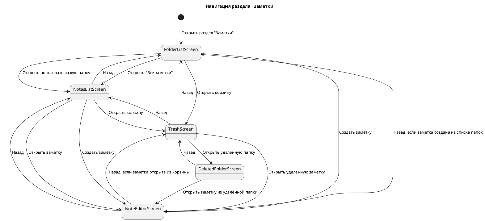
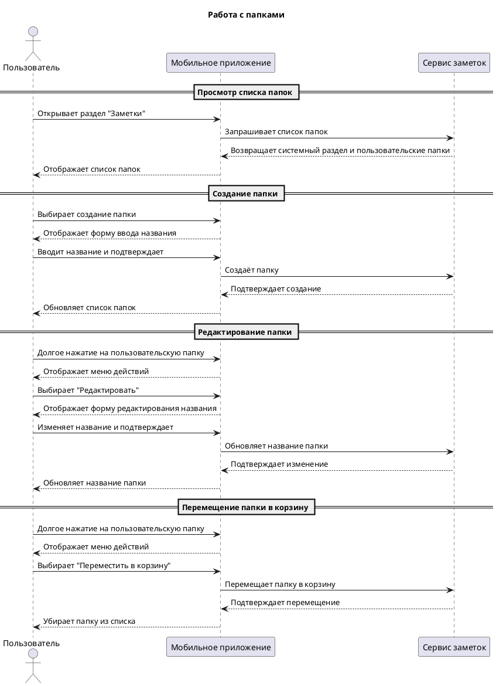
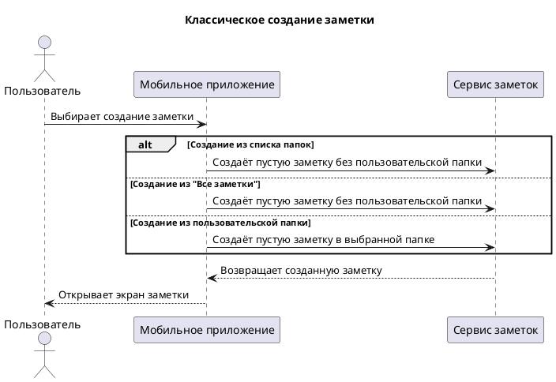
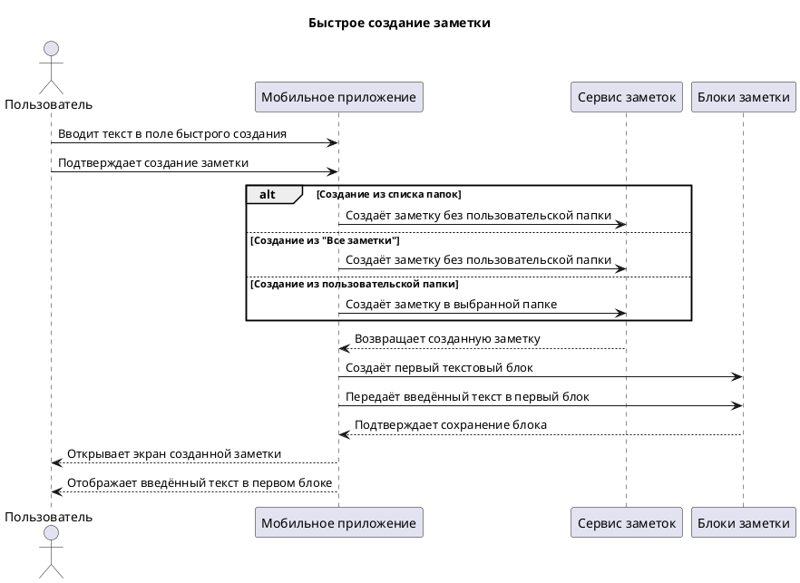
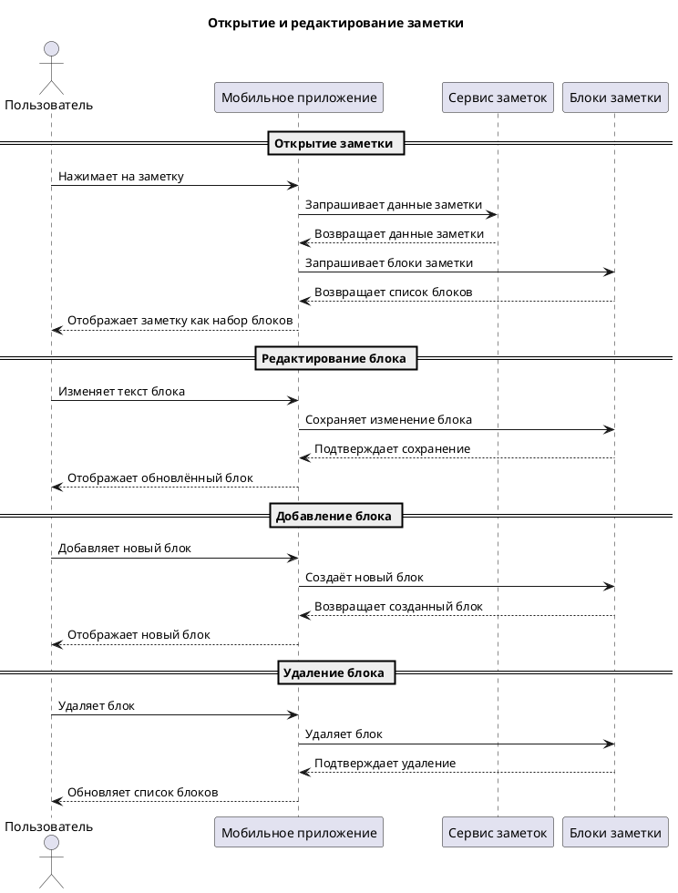
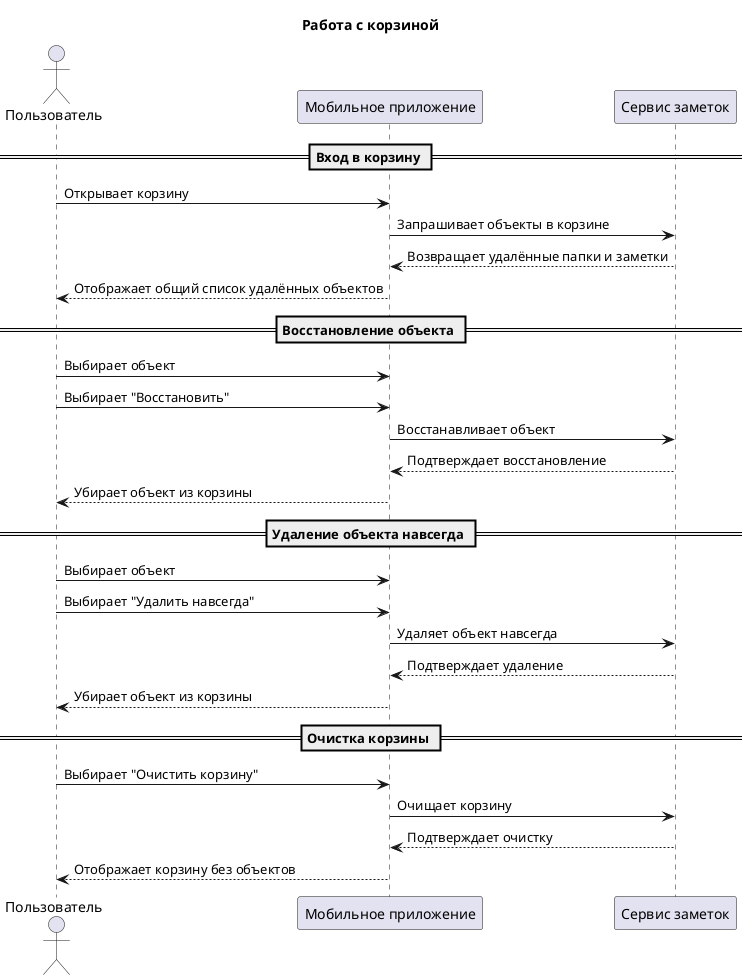

## 1. Задача

Необходимо подготовить требования для переноса функциональности заметок из веб-версии в мобильное приложение.

Мобильная версия должна реализовать основные сценарии работы с:

1. Папками.
    
2. Заметками.
    
3. Корзиной.
    

Функциональность уже существует на вебе, но мобильная версия не обязана повторять веб-интерфейс один в один. Необходимо описывать мобильные сценарии с учётом нативных паттернов iOS и Android.

## 2. Что нужно получить

На основе внутренней вики по аналитике заметок и OpenAPI-документации необходимо дополнить требования:

1. Раздел API:
    
    - folders;
        
    - notes;
        
    - blocks;
        
    - trash, если такие методы выделены отдельно в API.
        
2. Раздел ограничений:
    
    - ограничения по папкам;
        
    - ограничения по заметкам;
        
    - ограничения по блокам;
        
    - ограничения по корзине.
        
3. Для каждого Use Case определить:
    
    - какие API-методы нужны;
        
    - какие параметры передаются;
        
    - какие обязательные поля используются;
        
    - какие ответы ожидаются;
        
    - какие ограничения из API влияют на сценарий.
        

Важно: не нужно придумывать методы, параметры или ограничения, если их нет в документации. Если информации в документации недостаточно, нужно явно отметить это в разделе “Открытые вопросы”.

---

# 3. Зафиксированные вводные

## 3.1. Область первой версии

Функциональность делится на три блока:

1. Папки.
    
2. Заметки.
    
3. Корзина.
    

В первую версию входят сценарии:

### Папки

- просмотр списка папок;
    
- создание папки;
    
- открытие папки;
    
- редактирование названия папки;
    
- перенос папки в корзину.
    

### Заметки

- просмотр списка заметок;
    
- создание заметки;
    
- быстрое создание заметки;
    
- открытие заметки;
    
- редактирование заметки в блочном редакторе;
    
- перенос заметки в корзину.
    

### Корзина

- вход в корзину из раздела папок;
    
- вход в корзину из раздела заметок;
    
- просмотр удалённых папок и заметок в общем списке;
    
- открытие удалённой папки;
    
- восстановление папки из корзины;
    
- восстановление заметки из корзины;
    
- удаление папки из корзины навсегда;
    
- удаление заметки из корзины навсегда;
    
- очистка корзины.
    

---

## 3.2. Папки

- Поддерживается только один уровень папок.
    
- Вложенные папки не поддерживаются.
    
- Название папки: от 1 до 200 символов.
    
- Допускается создание нескольких папок с одинаковым названием.
    
- При переносе папки в корзину вместе с ней в корзину переносятся заметки, находящиеся в этой папке.
    
- Системный раздел “Все заметки” отображается среди папок.
    
- Системный раздел “Все заметки” нельзя переименовать или переместить в корзину.
    

---

## 3.3. Заметки

- Максимальное количество заметок — 255.
    
- Заметка может существовать без пользовательской папки.
    
- Каждая заметка всегда относится к системному разделу “Все заметки”.
    
- Заметка может дополнительно находиться в пользовательской папке.
    
- У заметки нет отдельного пользовательского заголовка.
    
- В списке заметок отображается текстовое превью из первого блока заметки.
    
- Ориентировочная длина превью — около 20 символов.
    
- Поиск в первой версии не реализуется.
    
- Сортировка, закрепление и избранное в первой версии не реализуются.
    
- Перенос заметки между папками в мобильной версии в первой версии не реализуется.
    

---

## 3.4. Блочный редактор

Заметка не является одним текстовым полем.

Заметка состоит из блоков. Содержимое заметки редактируется через операции над блоками.

Нужно уточнить по API:

- как получить список блоков заметки;
    
- как создать блок;
    
- как изменить блок;
    
- как удалить блок;
    
- как изменить порядок блоков, если поддерживается;
    
- какие типы блоков доступны;
    
- какие ограничения есть у блока;
    
- как сохраняется содержимое блока.
    

---

## 3.5. Быстрое создание заметки

Быстрое создание доступно через поле ввода на экране списка папок и на экране списка заметок.

После ввода текста и подтверждения:

1. Создаётся новая заметка.
    
2. Введённый текст становится содержимым первого блока.
    
3. Открывается экран созданной заметки.
    

Если быстрое создание выполняется из списка папок или из раздела “Все заметки”, заметка создаётся без пользовательской папки.

Если быстрое создание выполняется из пользовательской папки, заметка создаётся в этой папке и также отображается в “Все заметки”.

---

## 3.6. Корзина

- В корзину можно перейти из раздела папок.
    
- В корзину можно перейти из раздела заметок.
    
- Экран корзины содержит общий список удалённых папок и заметок.
    
- Папки и заметки отображаются в одном списке.
    
- При удалении из корзины объект удаляется навсегда.
    
- Очистка корзины удаляет все объекты из корзины.
    
- Объекты автоматически удаляются из корзины через 90 дней после перемещения.
    
- Можно открыть папку, находящуюся в корзине.
    
- Можно восстановить отдельную заметку из папки, находящейся в корзине.
    
- Если заметка восстановлена из папки, которая всё ещё находится в корзине, заметка попадает в “Все заметки”, а сама папка не восстанавливается.
    

---

# 4. User Stories

## 4.1. Папки

### US-F-01. Просмотр списка папок

Как пользователь мобильного приложения, я хочу видеть список доступных папок с заметками, чтобы быстро перейти к нужной группе заметок.

Критерии приемки:

- На экране списка папок отображается системный раздел “Все заметки”.
    
- На экране списка папок отображаются пользовательские папки.
    
- Системный раздел “Все заметки” отображается среди папок, но не является пользовательской папкой.
    
- Пользователь может открыть системный раздел “Все заметки”.
    
- Пользователь может открыть пользовательскую папку.
    
- Для системного раздела “Все заметки” недоступны действия редактирования и перемещения в корзину.
    

### US-F-02. Создание папки

Как пользователь мобильного приложения, я хочу создать новую папку, чтобы группировать заметки по нужной мне теме.

Критерии приемки:

- Пользователь может инициировать создание новой папки с экрана списка папок.
    
- При создании папки пользователь указывает название папки.
    
- Название папки должно соответствовать ограничениям по длине.
    
- Допускается создание папки с названием, которое уже используется другой папкой.
    
- После успешного создания папка отображается в списке папок.
    
- Если папку создать не удалось, пользователь остаётся в текущем сценарии и видит сообщение об ошибке.
    

### US-F-03. Открытие папки

Как пользователь мобильного приложения, я хочу открыть папку, чтобы увидеть заметки, которые находятся внутри неё.

Критерии приемки:

- Пользователь может открыть пользовательскую папку из списка папок.
    
- После открытия папки пользователь попадает на экран списка заметок внутри выбранной папки.
    
- На экране списка заметок отображается название открытой папки.
    
- Если в папке нет заметок, список заметок отображается без элементов.
    
- Пользователь может вернуться из папки обратно к списку папок.
    

### US-F-04. Редактирование названия папки

Как пользователь мобильного приложения, я хочу изменить название пользовательской папки, чтобы поддерживать актуальную структуру своих заметок.

Критерии приемки:

- Пользователь может вызвать действие редактирования для пользовательской папки.
    
- Действие редактирования доступно через долгое нажатие на папку.
    
- Пользователь может изменить название папки.
    
- Новое название папки должно соответствовать ограничениям по длине.
    
- Допускается сохранение названия, которое уже используется другой папкой.
    
- После успешного изменения новое название отображается в списке папок и на экране открытой папки.
    
- Для системного раздела “Все заметки” действие редактирования недоступно.
    

### US-F-05. Перемещение папки в корзину

Как пользователь мобильного приложения, я хочу переместить пользовательскую папку в корзину, чтобы убрать её из основного списка без немедленного окончательного удаления.

Критерии приемки:

- Пользователь может вызвать действие перемещения в корзину для пользовательской папки.
    
- Действие перемещения в корзину доступно через долгое нажатие на папку.
    
- При перемещении папки в корзину вместе с ней в корзину перемещаются заметки, которые находятся внутри этой папки.
    
- После успешного перемещения папка исчезает из основного списка папок.
    
- Для системного раздела “Все заметки” действие перемещения в корзину недоступно.
    
- Если переместить папку в корзину не удалось, пользователь видит сообщение об ошибке.
    

---

## 4.2. Заметки

### US-N-01. Просмотр списка заметок

Как пользователь мобильного приложения, я хочу видеть список заметок, чтобы быстро найти и открыть нужную заметку.

Критерии приемки:

- Пользователь может открыть список заметок из системного раздела “Все заметки”.
    
- Пользователь может открыть список заметок из пользовательской папки.
    
- В системном разделе “Все заметки” отображаются все заметки пользователя.
    
- В пользовательской папке отображаются только заметки, относящиеся к этой папке.
    
- В списке заметок для каждой заметки отображается текстовое превью.
    
- Текстовое превью формируется из содержимого первого блока заметки.
    
- Отдельный пользовательский заголовок заметки не отображается.
    
- Поиск, сортировка, закрепление и избранное в рамках первой версии не реализуются.
    

### US-N-02. Создание заметки

Как пользователь мобильного приложения, я хочу создать новую заметку, чтобы быстро зафиксировать текстовую информацию.

Критерии приемки:

- Пользователь может инициировать создание заметки из списка папок.
    
- Пользователь может инициировать создание заметки из списка заметок.
    
- Пользователь может создать заметку классическим способом через действие “Создать заметку”.
    
- Пользователь может создать заметку через быстрое создание, введя текст в поле быстрого создания заметки.
    
- Если пользователь создаёт заметку из списка папок, заметка создаётся без пользовательской папки и отображается в системном разделе “Все заметки”.
    
- Если пользователь создаёт заметку из раздела “Все заметки”, заметка создаётся без пользовательской папки и отображается в системном разделе “Все заметки”.
    
- Если пользователь создаёт заметку из пользовательской папки, заметка создаётся в этой папке и также отображается в системном разделе “Все заметки”.
    
- При классическом создании через действие “Создать заметку” создаётся новая пустая заметка, после чего пользователь переходит на экран открытой заметки.
    
- При быстром создании пользователь вводит текст в поле быстрого создания заметки.
    
- После подтверждения быстрого создания введённый пользователем текст становится содержимым первого блока новой заметки.
    
- После успешного быстрого создания пользователь переходит на экран открытой заметки.
    
- Содержимое заметки хранится в виде блоков.
    
- Если создать заметку не удалось, пользователь видит сообщение об ошибке.
    

### US-N-03. Открытие заметки

Как пользователь мобильного приложения, я хочу открыть заметку, чтобы просмотреть или продолжить редактирование её содержимого.

Критерии приемки:

- Пользователь может открыть существующую заметку из списка заметок.
    
- Пользователь может перейти на экран открытой заметки после классического создания новой заметки.
    
- Пользователь может перейти на экран открытой заметки после быстрого создания новой заметки.
    
- При открытии существующей заметки на экране отображается её сохранённое содержимое.
    
- При открытии заметки после классического создания отображается новая пустая заметка.
    
- При открытии заметки после быстрого создания отображается новая заметка, в которой введённый пользователем текст находится в первом блоке.
    
- На экране открытой заметки содержимое отображается в виде блоков.
    
- Пользователь может вернуться из открытой заметки обратно к предыдущему экрану.
    
- Если заметку открыть не удалось, пользователь видит сообщение об ошибке.
    

### US-N-04. Редактирование заметки в блочном редакторе

Как пользователь мобильного приложения, я хочу редактировать содержимое заметки, чтобы изменять и дополнять сохранённую информацию.

Критерии приемки:

- Пользователь может редактировать заметку на экране открытой заметки.
    
- Содержимое заметки представлено не одним текстовым полем, а набором блоков.
    
- Пользователь может добавлять текстовые блоки.
    
- Пользователь может изменять содержимое текстовых блоков.
    
- Пользователь может удалять текстовые блоки.
    
- Пользователь может изменять порядок блоков, если такая операция поддерживается API.
    
- После изменения содержимого заметки данные должны быть сохранены согласно логике работы редактора.
    
- Точный набор операций над блоками должен быть уточнён по API-документации.
    
- Если изменение блока не удалось сохранить, пользователь видит сообщение об ошибке.
    

### US-N-05. Перемещение заметки в корзину

Как пользователь мобильного приложения, я хочу переместить заметку в корзину, чтобы убрать её из основного списка без немедленного окончательного удаления.

Критерии приемки:

- Пользователь может вызвать действие перемещения заметки в корзину.
    
- Действие перемещения в корзину доступно через долгое нажатие на заметку в списке.
    
- После успешного перемещения заметка исчезает из основного списка заметок.
    
- Если заметка находилась в пользовательской папке, она также исчезает из списка заметок этой папки.
    
- Если переместить заметку в корзину не удалось, пользователь видит сообщение об ошибке.
    

---

## 4.3. Корзина

### US-T-01. Вход в корзину

Как пользователь мобильного приложения, я хочу перейти в корзину из раздела папок или заметок, чтобы посмотреть удалённые объекты.

Критерии приемки:

- Пользователь может перейти в корзину из раздела папок.
    
- Пользователь может перейти в корзину из раздела заметок.
    
- В корзине отображаются удалённые папки и удалённые заметки.
    
- Удалённые папки и заметки отображаются в общем списке.
    
- Подробные UI-требования к экрану корзины в рамках текущего документа не описываются.
    

### US-T-02. Просмотр удалённых объектов

Как пользователь мобильного приложения, я хочу видеть удалённые папки и заметки в корзине, чтобы понимать, какие объекты можно восстановить или удалить окончательно.

Критерии приемки:

- В корзине отображаются папки, перемещённые в корзину.
    
- В корзине отображаются заметки, перемещённые в корзину.
    
- Для объектов в корзине должно быть понятно, является объект папкой или заметкой.
    
- Для объектов в корзине должны быть доступны действия восстановления и окончательного удаления.
    
- Объекты хранятся в корзине 90 дней после перемещения.
    
- После истечения 90 дней объекты удаляются из корзины автоматически.
    

### US-T-03. Открытие папки из корзины

Как пользователь мобильного приложения, я хочу открыть папку, находящуюся в корзине, чтобы посмотреть удалённые вместе с ней заметки.

Критерии приемки:

- Пользователь может открыть папку, находящуюся в корзине.
    
- После открытия папки пользователь видит список заметок, которые были перемещены в корзину вместе с этой папкой.
    
- Пользователь может восстановить отдельную заметку из удалённой папки.
    
- Пользователь может вернуться из удалённой папки обратно в корзину.
    

### US-T-04. Восстановление папки из корзины

Как пользователь мобильного приложения, я хочу восстановить папку из корзины, чтобы вернуть её и связанные с ней заметки в основной список.

Критерии приемки:

- Пользователь может восстановить папку из корзины.
    
- После восстановления папка возвращается в список пользовательских папок.
    
- Заметки, которые были перемещены в корзину вместе с папкой, восстанавливаются вместе с ней.
    
- Восстановленная папка отображается с тем же названием, с которым была перемещена в корзину.
    
- Допускается восстановление папки, если в основном списке уже есть папка с таким же названием.
    
- Если восстановить папку не удалось, пользователь видит сообщение об ошибке.
    

### US-T-05. Восстановление заметки из корзины

Как пользователь мобильного приложения, я хочу восстановить заметку из корзины, чтобы вернуть её в доступные заметки.

Критерии приемки:

- Пользователь может восстановить отдельную заметку из корзины.
    
- После восстановления заметка отображается в разделе “Все заметки”.
    
- Если заметка была удалена отдельно из пользовательской папки, поведение восстановления в пользовательскую папку должно быть уточнено по API-документации.
    
- Если заметка восстанавливается из папки, которая всё ещё находится в корзине, заметка восстанавливается в раздел “Все заметки” без восстановления исходной папки.
    
- Если восстановить заметку не удалось, пользователь видит сообщение об ошибке.
    

### US-T-06. Окончательное удаление объекта из корзины

Как пользователь мобильного приложения, я хочу удалить папку или заметку из корзины навсегда, чтобы полностью удалить ненужные данные.

Критерии приемки:

- Пользователь может удалить папку из корзины навсегда.
    
- Пользователь может удалить заметку из корзины навсегда.
    
- После окончательного удаления объект исчезает из корзины.
    
- После окончательного удаления объект нельзя восстановить средствами пользовательского интерфейса.
    
- Если удалить объект навсегда не удалось, пользователь видит сообщение об ошибке.
    

### US-T-07. Очистка корзины

Как пользователь мобильного приложения, я хочу очистить корзину, чтобы удалить все находящиеся в ней объекты навсегда.

Критерии приемки:

- Пользователь может инициировать очистку корзины.
    
- При очистке корзины навсегда удаляются все папки и заметки, находящиеся в корзине.
    
- После успешной очистки корзина не содержит объектов.
    
- После очистки корзины удалённые объекты нельзя восстановить средствами пользовательского интерфейса.
    
- Если очистить корзину не удалось, пользователь видит сообщение об ошибке.
    

---

# 5. Use Cases

## 5.1. Папки

### UC-F-01. Просмотр списка папок

Связанная User Story: US-F-01.

Цель: показать пользователю список доступных разделов и пользовательских папок.

Основной сценарий:

1. Пользователь открывает раздел заметок в мобильном приложении.
    
2. Система запрашивает список доступных папок.
    
3. Система формирует список для отображения.
    
4. Система отображает системный раздел “Все заметки”.
    
5. Система отображает пользовательские папки.
    
6. Пользователь видит список папок и может выбрать нужный раздел.
    

Результат:

- Пользователь видит системный раздел “Все заметки”.
    
- Пользователь видит пользовательские папки.
    
- Пользователь может перейти в “Все заметки” или открыть пользовательскую папку.
    

### UC-F-02. Создание папки

Связанная User Story: US-F-02.

Цель: позволить пользователю создать новую пользовательскую папку.

Основной сценарий:

1. Пользователь нажимает на действие создания папки.
    
2. Система открывает интерфейс ввода названия папки.
    
3. Пользователь вводит название папки.
    
4. Пользователь подтверждает создание папки.
    
5. Система проверяет введённое название на соответствие ограничениям.
    
6. Система создаёт новую пользовательскую папку.
    
7. Система закрывает интерфейс создания.
    
8. Система отображает созданную папку в списке папок.
    

Результат:

- Новая папка создана.
    
- Новая папка отображается в списке пользовательских папок.
    

### UC-F-03. Открытие папки

Связанная User Story: US-F-03.

Цель: позволить пользователю открыть папку и просмотреть заметки, которые в ней находятся.

Основной сценарий:

1. Пользователь нажимает на пользовательскую папку.
    
2. Система открывает экран списка заметок выбранной папки.
    
3. Система запрашивает список заметок, относящихся к выбранной папке.
    
4. Система отображает название открытой папки.
    
5. Система отображает список заметок внутри выбранной папки.
    

Результат:

- Пользователь находится на экране выбранной папки.
    
- Пользователь видит заметки, относящиеся к выбранной папке.
    

### UC-F-04. Редактирование названия папки

Связанная User Story: US-F-04.

Цель: позволить пользователю изменить название пользовательской папки.

Основной сценарий:

1. Пользователь выполняет долгое нажатие на пользовательскую папку.
    
2. Система открывает меню действий папки.
    
3. Пользователь выбирает действие редактирования.
    
4. Система открывает интерфейс редактирования названия папки.
    
5. Пользователь изменяет название папки.
    
6. Пользователь подтверждает изменение.
    
7. Система проверяет новое название на соответствие ограничениям.
    
8. Система сохраняет новое название папки.
    
9. Система обновляет название папки в интерфейсе.
    

Результат:

- Название папки изменено.
    
- Новое название отображается в интерфейсе.
    

### UC-F-05. Перемещение папки в корзину

Связанная User Story: US-F-05.

Цель: позволить пользователю переместить пользовательскую папку в корзину.

Основной сценарий:

1. Пользователь выполняет долгое нажатие на пользовательскую папку.
    
2. Система открывает меню действий папки.
    
3. Пользователь выбирает действие перемещения в корзину.
    
4. Система перемещает папку в корзину.
    
5. Система перемещает в корзину заметки, которые находятся внутри этой папки.
    
6. Система удаляет папку из основного списка папок.
    
7. Система обновляет список папок.
    

Результат:

- Папка перемещена в корзину.
    
- Заметки внутри папки перемещены в корзину вместе с папкой.
    
- Папка больше не отображается в основном списке папок.
    

---

## 5.2. Заметки

### UC-N-01. Просмотр списка заметок

Связанная User Story: US-N-01.

Цель: показать пользователю список заметок в выбранном разделе.

Основной сценарий для “Все заметки”:

1. Пользователь открывает системный раздел “Все заметки”.
    
2. Система запрашивает список всех заметок пользователя.
    
3. Система отображает список заметок.
    
4. Для каждой заметки система отображает текстовое превью из первого блока.
    

Основной сценарий для пользовательской папки:

1. Пользователь открывает пользовательскую папку.
    
2. Система запрашивает список заметок выбранной папки.
    
3. Система отображает список заметок внутри папки.
    
4. Для каждой заметки система отображает текстовое превью из первого блока.
    

Результат:

- Пользователь видит список заметок выбранного раздела.
    
- Пользователь может открыть существующую заметку.
    
- Пользователь может создать новую заметку.
    

### UC-N-02A. Классическое создание заметки

Связанная User Story: US-N-02.

Цель: позволить пользователю создать новую пустую заметку и перейти к её редактированию.

Основной сценарий при создании из списка папок:

1. Пользователь нажимает действие создания заметки на экране списка папок.
    
2. Система создаёт новую пустую заметку без пользовательской папки.
    
3. Система относит заметку к системному разделу “Все заметки”.
    
4. Система открывает экран созданной заметки.
    

Основной сценарий при создании из “Все заметки”:

1. Пользователь нажимает действие создания заметки в разделе “Все заметки”.
    
2. Система создаёт новую пустую заметку без пользовательской папки.
    
3. Система относит заметку к системному разделу “Все заметки”.
    
4. Система открывает экран созданной заметки.
    

Основной сценарий при создании из пользовательской папки:

1. Пользователь нажимает действие создания заметки внутри пользовательской папки.
    
2. Система создаёт новую пустую заметку в выбранной пользовательской папке.
    
3. Система также относит заметку к системному разделу “Все заметки”.
    
4. Система открывает экран созданной заметки.
    

Результат:

- Новая пустая заметка создана.
    
- Пользователь находится на экране открытой заметки.
    
- Заметка отображается в “Все заметки”.
    
- Если заметка создана из пользовательской папки, она также отображается в этой папке.
    

### UC-N-02B. Быстрое создание заметки

Связанная User Story: US-N-02.

Цель: позволить пользователю быстро создать заметку из введённого текста.

Основной сценарий при создании из списка папок:

1. Пользователь вводит текст в поле быстрого создания заметки на экране списка папок.
    
2. Пользователь подтверждает создание заметки.
    
3. Система создаёт новую заметку без пользовательской папки.
    
4. Система создаёт первый текстовый блок заметки.
    
5. Система записывает введённый пользователем текст в первый блок.
    
6. Система относит заметку к системному разделу “Все заметки”.
    
7. Система открывает экран созданной заметки.
    

Основной сценарий при создании из “Все заметки”:

1. Пользователь вводит текст в поле быстрого создания заметки в разделе “Все заметки”.
    
2. Пользователь подтверждает создание заметки.
    
3. Система создаёт новую заметку без пользовательской папки.
    
4. Система создаёт первый текстовый блок заметки.
    
5. Система записывает введённый пользователем текст в первый блок.
    
6. Система относит заметку к системному разделу “Все заметки”.
    
7. Система открывает экран созданной заметки.
    

Основной сценарий при создании из пользовательской папки:

1. Пользователь вводит текст в поле быстрого создания заметки внутри пользовательской папки.
    
2. Пользователь подтверждает создание заметки.
    
3. Система создаёт новую заметку в выбранной пользовательской папке.
    
4. Система создаёт первый текстовый блок заметки.
    
5. Система записывает введённый пользователем текст в первый блок.
    
6. Система также относит заметку к системному разделу “Все заметки”.
    
7. Система открывает экран созданной заметки.
    

Результат:

- Новая заметка создана.
    
- Введённый пользователем текст сохранён как первый блок заметки.
    
- Пользователь находится на экране открытой заметки.
    

### UC-N-03. Открытие заметки

Связанная User Story: US-N-03.

Цель: позволить пользователю открыть заметку для просмотра или редактирования.

Основной сценарий при открытии существующей заметки:

1. Пользователь нажимает на заметку в списке заметок.
    
2. Система открывает экран выбранной заметки.
    
3. Система загружает содержимое заметки.
    
4. Система отображает содержимое заметки в виде блоков.
    

Основной сценарий после классического создания заметки:

1. Пользователь создаёт заметку классическим способом.
    
2. Система создаёт пустую заметку.
    
3. Система открывает экран созданной заметки.
    
4. Пользователь видит пустую заметку.
    

Основной сценарий после быстрого создания заметки:

1. Пользователь создаёт заметку через поле быстрого создания.
    
2. Система создаёт заметку.
    
3. Система создаёт первый блок заметки с введённым пользователем текстом.
    
4. Система открывает экран созданной заметки.
    
5. Пользователь видит заметку с заполненным первым блоком.
    

Результат:

- Пользователь находится на экране открытой заметки.
    
- Содержимое заметки отображается в виде блоков.
    

### UC-N-04. Редактирование заметки в блочном редакторе

Связанная User Story: US-N-04.

Цель: позволить пользователю изменять содержимое заметки через операции над блоками.

Основной сценарий редактирования существующего блока:

1. Пользователь выбирает текстовый блок заметки.
    
2. Пользователь изменяет содержимое блока.
    
3. Система сохраняет изменение блока.
    
4. Система отображает обновлённое содержимое блока.
    

Основной сценарий добавления нового блока:

1. Пользователь инициирует добавление нового блока.
    
2. Система создаёт новый блок в заметке.
    
3. Пользователь вводит содержимое нового блока.
    
4. Система сохраняет содержимое нового блока.
    
5. Система отображает новый блок в составе заметки.
    

Основной сценарий удаления блока:

1. Пользователь выбирает блок, который нужно удалить.
    
2. Пользователь инициирует удаление блока.
    
3. Система удаляет блок из заметки.
    
4. Система обновляет отображение заметки.
    

Основной сценарий изменения порядка блоков:

1. Пользователь инициирует изменение порядка блоков, если такая операция поддерживается.
    
2. Пользователь меняет положение блока в заметке.
    
3. Система сохраняет новый порядок блоков.
    
4. Система отображает блоки в обновлённом порядке.
    

Результат:

- Содержимое заметки изменено.
    
- Изменения сохранены на уровне соответствующих блоков.
    

### UC-N-05. Перемещение заметки в корзину

Связанная User Story: US-N-05.

Цель: позволить пользователю переместить заметку в корзину.

Основной сценарий:

1. Пользователь выполняет долгое нажатие на заметку.
    
2. Система открывает меню действий заметки.
    
3. Пользователь выбирает действие перемещения в корзину.
    
4. Система перемещает заметку в корзину.
    
5. Система удаляет заметку из текущего списка заметок.
    
6. Система обновляет список заметок.
    

Результат:

- Заметка перемещена в корзину.
    
- Заметка больше не отображается в основном списке заметок.
    

---

## 5.3. Корзина

### UC-T-01. Вход в корзину

Связанная User Story: US-T-01.

Цель: позволить пользователю перейти к удалённым объектам.

Основной сценарий:

1. Пользователь выбирает действие перехода в корзину.
    
2. Система открывает экран корзины.
    
3. Система запрашивает список объектов, находящихся в корзине.
    
4. Система отображает удалённые папки и заметки в общем списке.
    

Результат:

- Пользователь находится в корзине.
    
- Пользователь видит удалённые папки и заметки.
    

### UC-T-02. Просмотр удалённых объектов

Связанная User Story: US-T-02.

Цель: показать пользователю объекты, которые были перемещены в корзину.

Основной сценарий:

1. Система отображает список объектов в корзине.
    
2. Система отображает удалённые папки.
    
3. Система отображает удалённые заметки.
    
4. Для каждого объекта система отображает признак типа объекта: папка или заметка.
    

Результат:

- Пользователь видит удалённые объекты.
    
- Пользователь понимает, какие объекты являются папками, а какие — заметками.
    

### UC-T-03. Открытие папки из корзины

Связанная User Story: US-T-03.

Цель: позволить пользователю открыть удалённую папку и посмотреть заметки, которые были перемещены в корзину вместе с ней.

Основной сценарий:

1. Пользователь нажимает на папку в корзине.
    
2. Система открывает экран содержимого удалённой папки.
    
3. Система отображает заметки, которые были перемещены в корзину вместе с папкой.
    
4. Пользователь может выбрать отдельную заметку.
    
5. Пользователь может восстановить отдельную заметку из удалённой папки.
    
6. Пользователь может вернуться обратно в корзину.
    

Результат:

- Пользователь видит содержимое папки, находящейся в корзине.
    
- Пользователь может восстановить отдельную заметку из этой папки.
    

### UC-T-04. Восстановление папки из корзины

Связанная User Story: US-T-04.

Цель: позволить пользователю восстановить удалённую папку вместе с заметками.

Основной сценарий:

1. Пользователь выбирает папку в корзине.
    
2. Пользователь инициирует восстановление папки.
    
3. Система восстанавливает папку из корзины.
    
4. Система восстанавливает заметки, которые были перемещены в корзину вместе с этой папкой.
    
5. Система удаляет папку из списка объектов корзины.
    
6. Система отображает восстановленную папку в основном списке папок.
    

Результат:

- Папка восстановлена.
    
- Заметки внутри папки восстановлены вместе с папкой.
    

### UC-T-05. Восстановление заметки из корзины

Связанная User Story: US-T-05.

Цель: позволить пользователю восстановить отдельную заметку из корзины.

Основной сценарий восстановления заметки из общего списка корзины:

1. Пользователь выбирает заметку в корзине.
    
2. Пользователь инициирует восстановление заметки.
    
3. Система восстанавливает заметку.
    
4. Система удаляет заметку из списка объектов корзины.
    
5. Система отображает восстановленную заметку в разделе “Все заметки”.
    

Основной сценарий восстановления заметки из папки, находящейся в корзине:

1. Пользователь открывает папку, находящуюся в корзине.
    
2. Система отображает заметки, которые были перемещены в корзину вместе с папкой.
    
3. Пользователь выбирает отдельную заметку.
    
4. Пользователь инициирует восстановление заметки.
    
5. Система восстанавливает выбранную заметку.
    
6. Система удаляет заметку из списка удалённых заметок внутри папки.
    
7. Система отображает восстановленную заметку в разделе “Все заметки”.
    

Результат:

- Заметка восстановлена.
    
- Заметка отображается в разделе “Все заметки”.
    
- Если заметка была восстановлена из папки, которая всё ещё находится в корзине, исходная папка не восстанавливается.
    

### UC-T-06. Окончательное удаление объекта из корзины

Связанная User Story: US-T-06.

Цель: позволить пользователю окончательно удалить папку или заметку из корзины.

Основной сценарий:

1. Пользователь выбирает папку или заметку в корзине.
    
2. Пользователь инициирует окончательное удаление объекта.
    
3. Система окончательно удаляет объект.
    
4. Система удаляет объект из списка корзины.
    
5. Система обновляет список объектов в корзине.
    

Результат:

- Объект окончательно удалён.
    
- Объект больше не отображается в корзине.
    

### UC-T-07. Очистка корзины

Связанная User Story: US-T-07.

Цель: позволить пользователю окончательно удалить все объекты из корзины.

Основной сценарий:

1. Пользователь инициирует очистку корзины.
    
2. Система окончательно удаляет все папки и заметки, находящиеся в корзине.
    
3. Система обновляет список объектов корзины.
    

Результат:

- Корзина очищена.
    
- В корзине не отображаются удалённые объекты.
    

---

# 6. UI требования

## 6.1. Общий подход

Концепт интерфейса используется как ориентир для состава экранов, основных элементов и навигации.

В требованиях не фиксируются точные отступы, размеры, цвета, иконки и расположение элементов. Эти параметры определяются в дизайн-макетах.

Подробные UI-требования описываются для следующих экранов:

1. Экран списка папок.
    
2. Экран списка заметок.
    
3. Экран открытой заметки.
    

Для корзины фиксируются только наличие экрана, общий состав и переходы. Детальные UI-требования для корзины не описываются.

---

## 6.2. Общие UI-паттерны и нативные элементы

### Верхняя навигационная панель

|Назначение|iOS|Android|
|---|---|---|
|Верхняя панель экрана|Navigation Bar|Top App Bar|
|Возврат назад|Back Button|Navigate Up|
|Действия в верхней панели|UIBarButtonItem|IconButton|

### Списки и элементы списков

|Назначение|iOS|Android|
|---|---|---|
|Список элементов|UICollectionView / UITableView|RecyclerView / LazyColumn|
|Элемент списка|UICollectionViewCell / UITableViewCell|Card / ListItem|

### Ввод текста

|Назначение|iOS|Android|
|---|---|---|
|Однострочный ввод|UITextField|TextField|
|Многострочный ввод / блок заметки|UITextView или кастомный текстовый компонент|TextField или кастомный текстовый компонент|
|Кнопка действия|UIButton|Button / IconButton|

### Модальные элементы

|Назначение|iOS|Android|
|---|---|---|
|Диалог ввода или подтверждения|UIAlertController|AlertDialog|
|Нижний модальный блок|UISheetPresentationController|Modal Bottom Sheet|

### Действия по долгому нажатию

Долгое нажатие используется для вызова доступных действий над папкой или заметкой.

|Объект|Доступные действия|
|---|---|
|Пользовательская папка|Редактировать, переместить в корзину|
|Заметка|Переместить в корзину|
|“Все заметки”|Действия редактирования и удаления не отображаются|

Нативные элементы:

|iOS|Android|
|---|---|
|UIContextMenuInteraction|Modal Bottom Sheet / DropdownMenu|

Контекстное меню не является отдельным экраном. Это UI-элемент, который открывается поверх текущего экрана после долгого нажатия на объект.

---

## 6.3. Экран списка папок

### Назначение

Экран предназначен для отображения системного раздела “Все заметки” и пользовательских папок.

### Состав экрана

На экране отображаются:

- верхняя навигационная панель;
    
- заголовок экрана;
    
- системный раздел “Все заметки”;
    
- список пользовательских папок;
    
- действие создания папки;
    
- действие создания заметки;
    
- поле быстрого создания заметки;
    
- действие перехода в корзину.
    

### Элемент папки

Элемент папки содержит:

- название папки;
    
- визуальный признак папки;
    
- возможность открытия по нажатию.
    

Системный раздел “Все заметки” отображается среди папок, но для него не отображаются действия редактирования и перемещения в корзину.

### Взаимодействие

Пользователь может:

- нажать на “Все заметки” и перейти к списку всех заметок;
    
- нажать на пользовательскую папку и перейти к списку заметок этой папки;
    
- создать новую папку;
    
- создать новую заметку;
    
- ввести текст в поле быстрого создания заметки;
    
- выполнить долгое нажатие на пользовательскую папку и открыть меню действий;
    
- перейти в корзину.
    

---

## 6.4. Экран списка заметок

### Назначение

Экран предназначен для отображения заметок выбранного раздела.

Экран открывается:

- из раздела “Все заметки”;
    
- из пользовательской папки.
    

### Состав экрана

На экране отображаются:

- верхняя навигационная панель;
    
- кнопка возврата назад;
    
- заголовок текущего раздела или папки;
    
- список заметок;
    
- действие создания заметки;
    
- поле быстрого создания заметки;
    
- действие перехода в корзину.
    

### Элемент заметки

Элемент заметки содержит:

- текстовое превью заметки;
    
- возможность открытия по нажатию.
    

Текстовое превью формируется из первого блока заметки.

Отдельный заголовок заметки не отображается.

Карточки с изображениями в рамках первой версии не описываются.

### Взаимодействие

Пользователь может:

- нажать на заметку и перейти к экрану открытой заметки;
    
- создать новую заметку;
    
- ввести текст в поле быстрого создания заметки;
    
- выполнить долгое нажатие на заметку и открыть меню действий;
    
- перейти в корзину;
    
- вернуться назад на экран списка папок.
    

---

## 6.5. Экран открытой заметки

### Назначение

Экран предназначен для просмотра и редактирования содержимого заметки.

### Состав экрана

На экране отображаются:

- верхняя навигационная панель;
    
- кнопка возврата назад;
    
- область редактора заметки;
    
- блоки заметки;
    
- элементы управления редактором, если они предусмотрены логикой редактора.
    

Заметка отображается как набор блоков.

Отдельный пользовательский заголовок заметки не отображается.

### Варианты открытия

Экран открытой заметки открывается:

- при нажатии на существующую заметку;
    
- после классического создания пустой заметки;
    
- после быстрого создания заметки с заполненным первым блоком.
    

### Взаимодействие

Пользователь может:

- просматривать содержимое заметки;
    
- редактировать текстовые блоки заметки;
    
- использовать доступные действия редактора;
    
- вернуться на предыдущий экран.
    

---

## 6.6. Модальный интерфейс создания/редактирования папки

### Назначение

Модальный интерфейс используется для создания новой папки или редактирования названия существующей папки.

### Состав

В модальном интерфейсе отображаются:

- заголовок действия;
    
- поле ввода названия папки;
    
- действие подтверждения;
    
- действие отмены.
    

### Варианты открытия

Модальный интерфейс открывается:

- с экрана списка папок при создании папки;
    
- из меню действий папки при редактировании названия.
    

После подтверждения или отмены пользователь возвращается на экран списка папок.

---

## 6.7. Экран корзины

### Назначение

Экран предназначен для отображения объектов, перемещённых в корзину.

Подробные UI-требования для корзины в рамках текущего документа не описываются.

### Состав экрана

На экране отображаются:

- верхняя навигационная панель;
    
- кнопка возврата назад;
    
- заголовок экрана;
    
- общий список удалённых объектов;
    
- удалённые папки;
    
- удалённые заметки;
    
- действие очистки корзины.
    

Папки и заметки должны быть визуально различимы.

### Взаимодействие

Пользователь может:

- вернуться на предыдущий экран;
    
- открыть удалённую папку;
    
- открыть удалённую заметку, если просмотр удалённых заметок предусмотрен интерфейсом;
    
- выполнить действия с объектами корзины, если они предусмотрены сценарием;
    
- очистить корзину.
    

---

## 6.8. Навигация между экранами

### Основная навигация

```text
Экран списка папок
    ├─→ Экран списка заметок: “Все заметки”
    ├─→ Экран списка заметок: пользовательская папка
    ├─→ Экран открытой заметки: создание заметки
    └─→ Экран корзины

Экран списка заметок
    ├─→ Экран открытой заметки: открытие заметки
    ├─→ Экран открытой заметки: создание заметки
    ├─→ Экран корзины
    └─→ Экран списка папок

Экран открытой заметки
    └─→ Предыдущий экран

Экран корзины
    ├─→ Удалённая папка
    ├─→ Открытая заметка, если просмотр предусмотрен интерфейсом
    └─→ Предыдущий экран
```

### Модальные сценарии

```text
Экран списка папок
    ├─→ Модальный интерфейс создания папки
    └─→ Меню действий пользовательской папки
            ├─→ Модальный интерфейс редактирования папки
            └─→ Действие “Переместить в корзину”

Экран списка заметок
    └─→ Меню действий заметки
            └─→ Действие “Переместить в корзину”
```

### Быстрое создание заметки

```text
Экран списка папок
    └─→ Поле быстрого создания заметки
            └─→ Экран открытой заметки

Экран списка заметок
    └─→ Поле быстрого создания заметки
            └─→ Экран открытой заметки
```

---

# 7. PlantUML

## 7.1. Навигация



## 7.2. Работа с папками



## 7.3. Классическое создание заметки



## 7.4. Быстрое создание заметки



## 7.5. Открытие и редактирование заметки



## 7.6. Работа с корзиной



---

# 8. Требования к доработке раздела API

ГигаКоду необходимо дополнить этот раздел на основе OpenAPI-документации.

## 8.1. Folders

Для сценариев папок нужно определить API-методы:

- получение списка папок;
    
- создание папки;
    
- изменение названия папки;
    
- перемещение папки в корзину;
    
- восстановление папки из корзины, если метод относится к folders;
    
- окончательное удаление папки, если метод относится к folders.
    

Для каждого метода указать:

- назначение метода;
    
- HTTP-метод;
    
- endpoint;
    
- обязательные параметры;
    
- тело запроса;
    
- ответ;
    
- ограничения;
    
- связанные Use Cases.
    

## 8.2. Notes

Для сценариев заметок нужно определить API-методы:

- получение списка заметок;
    
- получение заметок из “Все заметки”;
    
- получение заметок из пользовательской папки;
    
- создание заметки без пользовательской папки;
    
- создание заметки в пользовательской папке;
    
- получение данных заметки;
    
- перемещение заметки в корзину;
    
- восстановление заметки;
    
- окончательное удаление заметки.
    

Для каждого метода указать:

- назначение метода;
    
- HTTP-метод;
    
- endpoint;
    
- обязательные параметры;
    
- тело запроса;
    
- ответ;
    
- ограничения;
    
- связанные Use Cases.
    

## 8.3. Blocks

Для блочного редактора нужно определить API-методы:

- получение списка блоков заметки;
    
- создание блока;
    
- изменение блока;
    
- удаление блока;
    
- изменение порядка блоков, если поддерживается;
    
- получение ограничений по блокам, если они описаны.
    

Для каждого метода указать:

- назначение метода;
    
- HTTP-метод;
    
- endpoint;
    
- обязательные параметры;
    
- тело запроса;
    
- ответ;
    
- ограничения;
    
- связанные Use Cases.
    

## 8.4. Trash

Если в API есть отдельная группа методов для корзины, нужно описать:

- получение объектов корзины;
    
- восстановление объекта;
    
- удаление объекта из корзины навсегда;
    
- очистку корзины;
    
- открытие папки в корзине;
    
- восстановление заметки из папки, находящейся в корзине.
    

Для каждого метода указать:

- назначение метода;
    
- HTTP-метод;
    
- endpoint;
    
- обязательные параметры;
    
- тело запроса;
    
- ответ;
    
- ограничения;
    
- связанные Use Cases.
    

---

# 9. Требования к доработке раздела ограничений

ГигаКоду необходимо извлечь ограничения из OpenAPI-документации и внутренней вики.

Ограничения нужно сгруппировать по объектам:

## 9.1. Папки

Нужно проверить и дополнить:

- минимальная длина названия;
    
- максимальная длина названия;
    
- допустимость одинаковых названий;
    
- наличие лимита количества папок;
    
- возможность удаления системных папок;
    
- правила перемещения папки в корзину;
    
- правила восстановления папки.
    

## 9.2. Заметки

Нужно проверить и дополнить:

- лимит количества заметок;
    
- правила создания заметки без пользовательской папки;
    
- правила создания заметки в пользовательской папке;
    
- наличие или отсутствие отдельного заголовка;
    
- правила формирования превью заметки;
    
- правила перемещения заметки в корзину;
    
- правила восстановления заметки.
    

## 9.3. Блоки

Нужно проверить и дополнить:

- типы блоков;
    
- лимит количества блоков;
    
- лимит длины текста блока;
    
- правила создания первого блока;
    
- правила изменения блока;
    
- правила удаления блока;
    
- правила изменения порядка блоков;
    
- поведение при удалении последнего блока.
    

## 9.4. Корзина

Нужно проверить и дополнить:

- срок хранения объектов в корзине;
    
- правила автоматического удаления;
    
- правила восстановления папки;
    
- правила восстановления заметки;
    
- правила восстановления заметки из папки, находящейся в корзине;
    
- правила окончательного удаления;
    
- правила очистки корзины.